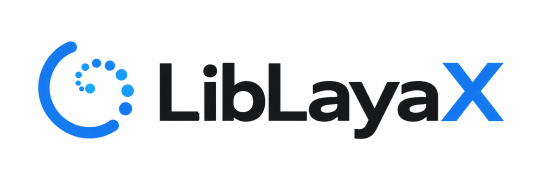

# LibLayaX

**Fast local AI decisions inside your application.** LibLayaX runs the Laya AI model
in-process, as an ordinary library, on six platforms: hundreds of decisions per second on a
laptop GPU, with no server and no cloud. An unofficial C API library built on laya.cpp.
Version 1.0.14.

## What this project is for

[Laya](https://github.com/NandhaKishorM/laya) is an AI model for decisions: a transformer
neural network (ModernBERT-large for English, mmBERT for 100+ languages) trained to read a
piece of text and answer typed questions about it. Is this a refund request, yes or no? Which
of these intents is it? How angry is the customer, on a scale? Unlike a chat model it does not
generate text. Its authors call it a "System 1" decision engine: one forward pass through the
network returns the answer with a probability.

**That single pass is what makes it fast.** A chat model writes its answer token by token;
Laya reads the text once and is done. Measured with this library and the English model, a
laptop GPU answers about 670 questions per second (1.5 milliseconds each), an Apple M3 Ultra
about 170 per second, and a fast desktop CPU alone 14 to 21 per second (see [Speed](#speed)).

That makes it the kind of AI that belongs *inside* software rather than in a chat window:
routing a support ticket, flagging a message, deciding whether a document needs review,
quickly enough to sit in the path of a request or to work through a backlog of thousands, with
the answer coming back as a label or a number rather than prose to parse.

The two existing implementations are not built to live inside another application:

* the original **Python library**, which needs Python and PyTorch wherever it runs;
* **[laya.cpp](https://github.com/lkarlslund/laya.cpp)**, the native C++ port on the ggml
  inference engine, which is a command-line tool and an HTTP server. An application has to
  start, monitor and talk to a separate process.

LibLayaX closes that gap. It turns the laya.cpp inference engine into one library file that an
application loads like any other library, so an AI decision becomes a function call:

* **Fast, with nothing in between.** A decision is a function call into the engine: no HTTP
  round trip, no serialization to another process. On a GPU, sending several questions in
  one call multiplies the throughput.
* **On-device AI, embedded.** The model runs on the user's own CPU or GPU, inside your
  process. No cloud API, no per-call fees, no Python, no server or second process to deploy.
  The text being analysed never leaves the machine, and it works offline.
* **From the language the application is already written in.** Ten plain C functions with
  JSON in and JSON out can be called from C, C++, Delphi, Rust, Lua, C#, Python, Go, Java and
  anything else that can load a shared library.
* **On the platforms real applications ship on.** Six targets from one source: Windows x64
  and ARM64, Linux x86-64 and ARM64, macOS on Apple Silicon and Intel. Inference runs on the
  CPU everywhere, and on the GPU through Vulkan on Windows, Linux and Apple Silicon.
* **Written once.** The same functions and the same JSON requests and responses on every
  platform, so an integration is done once and carried to the others.
* **Built to be a guest.** Errors come back as values instead of exceptions crossing into
  your code; one loaded model can be shared between threads; the host's floating-point
  settings are left as they were.

That is what the X stands for: cross-language and cross-platform. The aim is to make this kind
of AI practical in real-world desktop and server applications, not only in Python programs
and behind HTTP endpoints.

LibLayaX is an independent project. It is not part of Laya or of laya.cpp and is not endorsed
by their authors; see [Credits](#credits). What has and has not been tested on real hardware
is listed under [What has been tested](docs/platforms.md#what-has-been-tested-and-what-has-not).

## Getting the model

LibLayaX does not include the model. The weights are published by the Laya project on Hugging
Face, in the repository **[convaiinnovations/laya](https://huggingface.co/convaiinnovations/laya)**.
laya.cpp's download script takes all three variants from that one repository: `english` at
the top level, and `multilingual` and `typed-decisions` in subfolders of those names.

For each variant, five files are needed, kept in this layout:

```
model.safetensors                 the weights (about 800 MB for english)
rl_agent_config.json
encoder/config.json
tokenizer/tokenizer.json
tokenizer/tokenizer_config.json
```

Three ways to get them:

* **The script in this tree** (from laya.cpp) downloads exactly those files, at the revision
  laya.cpp pins, into `laya.cpp/models/laya`:

  ```
  pip install huggingface_hub
  python laya.cpp/scripts/download_model.py --variant all      (or english, multilingual, typed-decisions)
  ```

* **The Hugging Face command-line tool**, into any folder:

  ```
  pip install huggingface_hub
  huggingface-cli download convaiinnovations/laya --local-dir /models/laya \
      --include "model.safetensors" "rl_agent_config.json" "encoder/*" "tokenizer/*"
  ```

* **A browser:** open the repository page, go to "Files", and download the five files into the
  same folder structure.

The folder you then give to `laya_create` (or to `TLayaAgent.Create`, `Agent::new`,
`llaya.new`) is the one that contains `rl_agent_config.json`: `/models/laya` for english. For
another variant either give its subfolder, or give the top folder together with the option
`{"variant":"multilingual"}`.

The model is the Laya project's work and comes with its own terms; see the model card on the
repository page. Loading takes about a second and about 1.7 GB of memory on the CPU.

## Speed

Measured with `laya-bench` from this project, the English model (ModernBERT-large), questions
sent in batches of 16. "Per question" is the batch time divided by 16.

| Machine | Backend and precision | Questions per second | Per question |
|---|---|---:|---:|
| NVIDIA RTX 5080 Laptop GPU (Windows 11) | Vulkan, fp16 | about 670 | 1.5 ms |
| NVIDIA RTX 5080 Laptop GPU (Windows 11) | Vulkan, fp32 | about 230 | 4.3 ms |
| Intel Core Ultra 9 275HX (Windows 11) | CPU | about 21 | 48 ms |
| Apple M3 Ultra (macOS) | Vulkan on Metal, bf16 | 170 | 5.9 ms |
| Apple M3 Ultra (macOS) | Vulkan on Metal, fp32 | 111 | 9.0 ms |
| Apple M3 Ultra (macOS) | CPU | 14 | 70 ms |
| Windows 11 on ARM virtual machine, 4 virtual CPUs | CPU | 4 | 250 ms |
| Ubuntu 24.04 ARM64 virtual machine, 2 virtual CPUs | CPU | 2 | 490 ms |

A single question sent on its own takes 29 ms on the M3 Ultra's GPU and 76 ms on its CPU.
Loading the model takes about one second from a fast disk. The half-precision modes (`fp16`,
`bf16`) are the fastest; in these runs their probabilities stayed within about 0.003 of the
CPU's. Your numbers will differ with the hardware, the length of the texts and the
batch size; `laya-bench /path/to/model` prints them for your machine.

## Using it from your language

| Language | What to use | Where it lives |
|---|---|---|
| C, C++ | `laya_c.h` and the library (`laya.lib` for Visual C++) | this repository and the binary packages |
| Delphi, Free Pascal | `Laya.pas`, with the `TLayaAgent` class | the **DLaya** repository |
| Rust | the `rlaya` crate, with the `Agent` type | the **RLaya** repository |
| Lua | the `llaya` module (binaries for Lua 5.1) | the **LLaya** repository |
| C#, Python, Go, Java, ... | the language's own way of loading a C library | declare the ten functions from `laya_c.h` |

DLaya, RLaya and LLaya are small projects that sit on top of this library; each has its own
README, tests and example. Their source is not in this repository or in the binary
packages. The Windows and Linux x86-64 packages do include `LayaTests`, DLaya's test program
already built, so that the Delphi binding can be checked against each library.

**Names.** LibLayaX is the name of the project. The library files it produces are `laya.dll`
on Windows, `liblaya.so` on Linux and `liblaya.dylib` on macOS, and its functions start with
`laya_`.

## The API in one screen

```c
laya_agent* a = laya_create("C:\\models\\laya", "{\"backend\":\"cpu\"}");
if (!a) { puts(laya_last_error()); return 1; }
char* out = laya_predict(a,
    "{\"state\":\"Please refund the duplicate charge.\","
    " \"questions\":{\"refund\":{\"type\":\"noul\","
    "                \"instructions\":\"Does the customer ask for a refund?\"}}}");
puts(out);   /* {"results":[{"answers":{"refund":{"type":"noul","noul":0.8364,...}}}],...} */
laya_free_string(out);
laya_destroy(a);
```

| Function | Purpose |
|---|---|
| `laya_create(dir, options_json)` | Load a model. `NULL` on failure. |
| `laya_predict(agent, request_json)` | Answer one request or an array of them. |
| `laya_prepare(agent, request_json)` | Tokenized inputs only, for debugging. |
| `laya_info(agent)` | Backend, device, model and limits. |
| `laya_free_string(s)` | Free a string returned by the three calls above. |
| `laya_destroy(agent)` | Unload. |
| `laya_last_error()` | Last failure on the calling thread. |
| `laya_set_log_callback(fn, user, level)` | Receive the engine's log lines. |
| `laya_version()`, `laya_api_version()` | Identification; the API version is 1. |

Three kinds of question can be asked: `noul` (yes or no, as a probability), `choice` (one of
several options) and `score` (a level on a scale). Several questions and several texts can
go in one call. The details are in the documentation below.

## Documentation

The [`docs/`](docs/README.md) folder is the manual for the library.

| Page | Content |
|---|---|
| [Getting started](docs/getting-started.md) | Pick a package, download the model, get a first answer from ten lines of C. |
| [Requests and answers](docs/requests.md) | The three question types, several questions at once, batches, every field of the answer, the size limits. |
| [The API](docs/api.md) | The ten functions one by one: arguments, results, memory, threads, errors, logging. |
| [Options](docs/options.md) | CPU or GPU, precision, threads, which GPU, which model variant. |
| [Platforms and packages](docs/platforms.md) | Which library for which system, how to ship it with an application, what has been tested. |
| [Language bindings](docs/bindings.md) | DLaya, RLaya and LLaya, and how to call the library from any other language. |
| [Troubleshooting](docs/troubleshooting.md) | Error messages, the debug trace, crash reports, known problems. |
| [Testing](docs/testing.md) | The test and benchmark tools in every package. |
| [Building from source](docs/building.md) | Building every platform, and what LibLayaX adds to laya.cpp. |
| [History](docs/history.md) | What changed in each version. |

## What is in here

This repository is the source: upstream laya.cpp plus everything added for the library, its
tests, its diagnostic tools and the scripts that cross-build every platform from one Linux
machine. The binaries are in the releases.

```
LibLayaX/
├── README.md      this file: what the project is
├── docs/          the manual: using, shipping, testing and building the library
├── LICENSE        MIT, covering LibLayaX and the laya.cpp code it is built on
├── NOTICE         acknowledgements: Laya, laya.cpp and the libraries used
├── laya.cpp/      the complete source tree, ready to build
│                  (upstream laya.cpp at commit e632da0 + LibLayaX; ggml and cpp-httplib
│                  included, unmodified)
└── patches/       the same additions as 30 patches for `git am`, for applying to your own
                   checkout of upstream instead of using the tree above
```

### Which README is which

There are several README files in here and they are about different things:

| File | Written by | About |
|---|---|---|
| `README.md` (this one) | LibLayaX | The project: what it is for, how fast it is, where to start. |
| `docs/README.md` | LibLayaX | The index of the manual. |
| `laya.cpp/capi/README.md` | LibLayaX | A short reference that sits next to the library's source. |
| `laya.cpp/README.md` | upstream, unchanged | laya.cpp itself: the command-line tool, the HTTP server, benchmarks. It does not mention LibLayaX. |

## Credits

* **[Laya](https://github.com/NandhaKishorM/laya)** by NandhaKishorM is the original project:
  the model, the typed-decision primitives (`choice`, `score`, `noul`) and the Python
  reference implementation on PyTorch and Transformers. Apache-2.0. The weights are published
  on Hugging Face under `convaiinnovations`.
* **[laya.cpp](https://github.com/lkarlslund/laya.cpp)** by Lars Karlslund is the native C++
  port of Laya inference, built on ggml, with CPU, CUDA, Vulkan and Core ML backends. MIT.
  LibLayaX is a layer on top of it and contains its source.
* **LibLayaX**, its tests, tools and build scripts were written by Claude (Anthropic), under
  the direction of **Felipe Daragon** of **DaragonTech**, who set the goals, guided the work
  and ran every test on real Windows and Mac hardware.
* The binaries also contain [ggml](https://github.com/ggml-org/ggml) (MIT),
  [ICU](https://icu.unicode.org) (Unicode License) and
  [nlohmann/json](https://github.com/nlohmann/json) (MIT).

## License

LibLayaX is released under the MIT License; see [LICENSE](LICENSE). It is the same license as
laya.cpp, whose code this project contains and whose copyright notice the file keeps
(Copyright (c) 2026 Lars Karlslund; the original is also at `laya.cpp/LICENSE`).

Other parts keep their own terms:

* ggml and cpp-httplib, included in `laya.cpp/third_party/`, are MIT licensed; their license
  files are in their folders.
* The released binaries also contain ICU (Unicode License) and nlohmann/json (MIT), and the
  macOS Vulkan package bundles MoltenVK (Apache-2.0, license included in that package).
* Laya itself, the Python project, is Apache-2.0. None of its code is in this repository, which
  is why it has no copyright line in `LICENSE`; it is credited first in [NOTICE](NOTICE) and
  under [Credits](#credits).
* The model weights are not part of this project; they are published on Hugging Face under
  their own terms.
